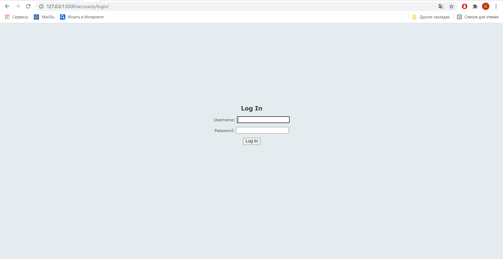
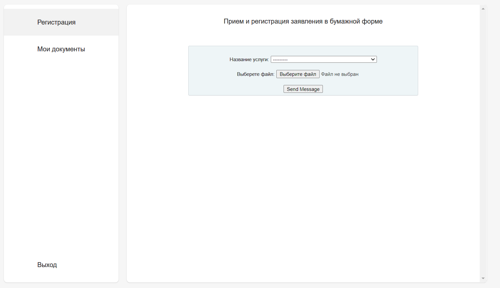
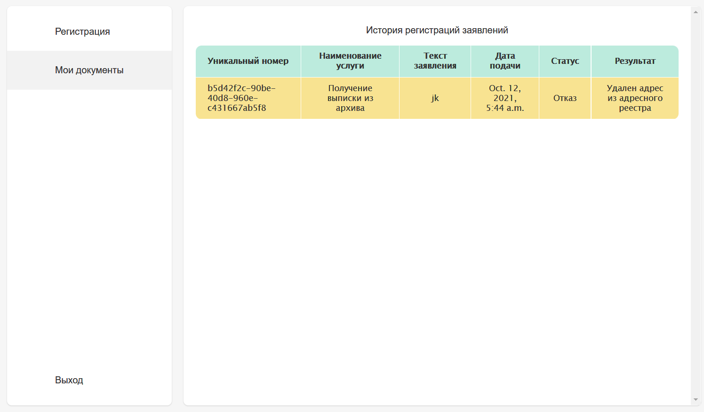
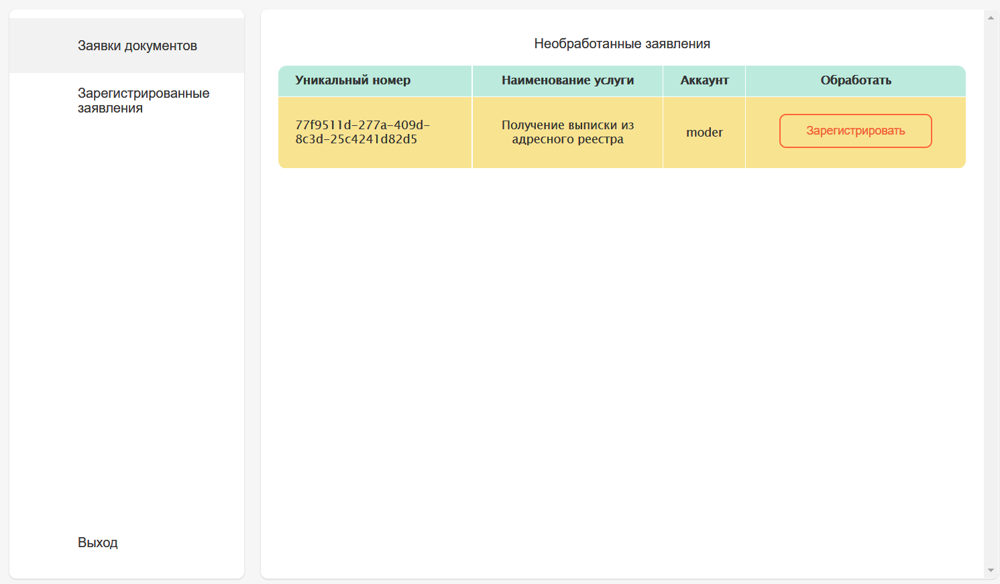
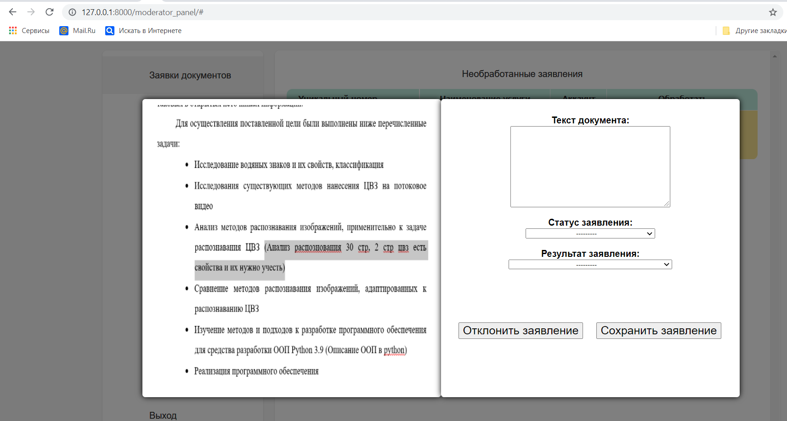
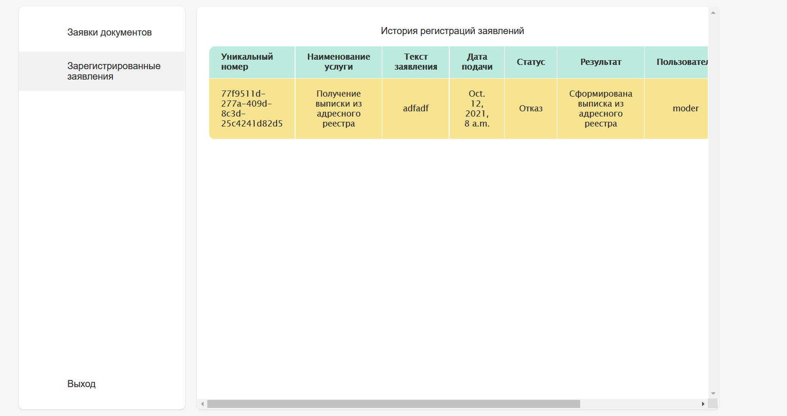
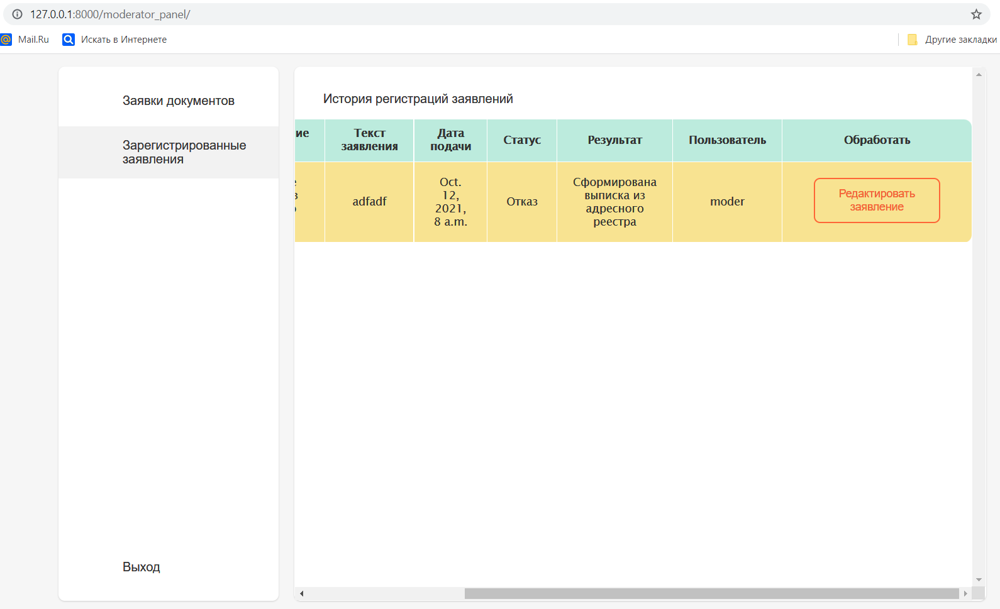

# Readme Django Dataplus project v0.1

The program was created in django using sqlite. It has 2 main roles, users and staff. Users send photo of documents for various services. And the staff enter the text into the database and present them with various statuses. A personal account was created for both roles.

## Usage

Setup requirements first, and after this run server
```python
pip3 install -r requirements.txt

python manage.py runserver 127.0.0.1:8000
```

##Authentication page



##Users Personal Area:
url:http://127.0.0.1:8000/doc_send/ \
first page

second page


##Staff Personal Area:
url:http://127.0.0.1:8000/moderator_panel/ \
first page    
Активная кнопка регистрации документа с popup

first page popup  \
слева документ который прислал пользователь, справа форма заполнения заявки

second page(1/2)  \

second page(2/2)  \
активная кнопка редактирования старых заявлений

